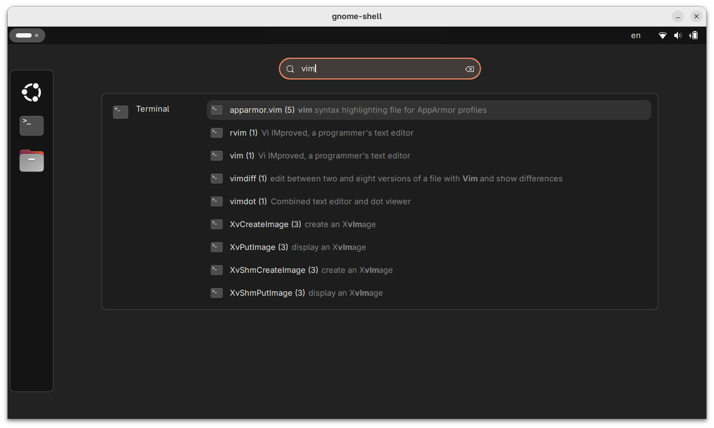

# Man Search Provider для GNOME Shell

**THIS IS EXAMPLE ONLY**

Поисковый провайдер для быстрого доступа к man-страницам прямо из GNOME Shell overview.

## Как это работает

1. Открываешь overview (Super/Windows клавиша)
2. Начинаешь печатать команду, например `grep`, `git`, `vim`
3. Видишь результаты из man-страниц
4. Кликаешь на результат → открывается man-страница в терминале

## Использование

Просто начни печатать в overview. Провайдер активируется автоматически для любого запроса 2 или более символов.

## Особенности реализации

- Использует `man -k` (apropos) для поиска
- Показывает название команды, секцию и описание
- Открывает man-страницу в gnome-terminal при клике
- Минимальная длина запроса: 2 символа

## Установка

Это код задуман как пример реализации поискового провайдера через расширение для GNOME Shell, и не предназначено для использования конечным потребителем.

Этот проект должен быть использован только как пример или "заготовка" для реализации своего поискового провайдера.

Смотри информацию ниже для как установить и начать разработку

Смотри [SearchProvider_Example.md](SearchProvider_Example.md) - для описания и объяснения кода и структуры расширения.

# Development

## Требования

- GNOME Shell версии 45-48 (для версии 49+ см. примечание ниже)
- Node.js 18+ и npm
- `man` в системе (обязателен только для этого примера)

## Target GNOME Shell Versions

This is an example extension for **GNOME Shell 45-48**.

**Note for GNOME Shell 49+:**  
The extension itself may work in GNOME Shell 49+, but the development workflow described below won't work because X11 is disabled by default. [To debug extensions in GNOME 49+, use the development kit](https://gjs.guide/extensions/upgrading/gnome-shell-49.html#debugging):

~~~sh
dbus-run-session -- gnome-shell --devkit
~~~

## Development Documentation

See:
- [Search Provider implementation as a GNOME Shell extension](https://gjs.guide/extensions/topics/search-provider.html)
- [GJS TypeScript type definitions for GNOME Shell Extensions ](https://github.com/gjsify/gnome-shell)

## Установка для разработки

1. Клонируй и установи зависимости: 

~~~sh
git clone https://github.com/LumenGNU/ManSearchProvider.git
cd ManSearchProvider
npm install
~~~

2. Собери и установи расширение:

~~~sh
npm run build    # TypeScript → JavaScript в dist/
npm run setup    # Копирует в ~/.local/share/gnome-shell/extensions/
~~~

3. Запусти вложенный GNOME Shell для тестирования:

~~~sh
npm run debug  # Откроет терминал с отладочным выводом и вложенную оболочку
~~~

4. Активируй расширение (**ВАЖНО**):

- **Внутри запущенной вложенной оболочке** открой приложение Extensions
- Включи "Man Search Provider"

или

- **Внутри запущенной вложенной оболочке** открой терминал
- Выполни
  ~~~sh
  gnome-extensions enable "man-search-provider@example.github.com"
  ~~~

5. Отладка

- Взаимодействуй с расширением (начни поиск)
- Смотри отладочный вывод

## Development Workflow

### Main commands:

~~~sh
npm run build   # Compile TypeScript to dist/
npm run setup   # Install extension to system
npm run debug   # Start nested GNOME Shell (opens terminal with debug output)
npm run dev     # Alias for `npm run build && npm run setup && npm run debug`
npm run clear   # Clear dist/ and remove installed extension
~~~

### Typical workflow:

~~~sh
# 1. Changed code
# 2. Build, install and run in nested shell:
npm run build && npm run setup && npm run debug

# 3. Shell crashed or closed the window? Restart:
npm run debug

# 4. Rebuild and reinstall:
npm run build && npm run setup

# 5. Restart nested shell:
npm run debug

# 6. Clear system:
npm run clear
~~~

### Common mistakes:

When using separate commands, it's easy to:
- Forget to recompile after code changes
- Forget to reinstall after build
- Forget to restart shell after installation
- Забыть активировать расширение после запуска Nested Shell

**Solution:** Use `npm run dev` for typical development cycle — it runs all three steps in correct order.

## Nested Shell:

- Opens in a separate window with log and debug output
- Safe for testing (doesn't crash your main desktop)
- Run: `npm run nested-shell:start`
- Stop and run (restart): `npm run nested-shell:restart`
- Stop: `npm run nested-shell:stop` or close the terminal window
- Взаимодействие с Nested Shell может происходить значительно медленнее

⚠️ [**This is designed for GNOME Shell 45-48 and won't work in GNOME Shell 49+.**](https://gjs.guide/extensions/upgrading/gnome-shell-49.html#debugging)

## Build and Debug Configuration

Settings in `package.json` section `config`:

~~~jsonc
"config": {
  "ID": "man-search-provider@example.github.com",            // Extension UUID
  "DIST_DIR": "./dist",                                      // Build directory
  "EXTENSION_DIR": "~/.local/share/gnome-shell/extensions",  // Installation path
  "TERMINAL": "gnome-terminal",                              // Terminal for debug logs
  "TERMINAL_PARAM": "--",                                    // Terminal parameter for running commands
  "LANG": "C"                                                // Полезно для проверки переводов. Например de_DE.UTF-8, fr_FR.UTF-8
}
~~~

### For your extension, change:

- `ID` to your `UUID` (must match with `uuid` in `metadata.json`)
- `TERMINAL` — your terminal program
- `TERMINAL_PARAM` — parameter for running commands (`--`, `-e`, or `-c` depending on your terminal)
