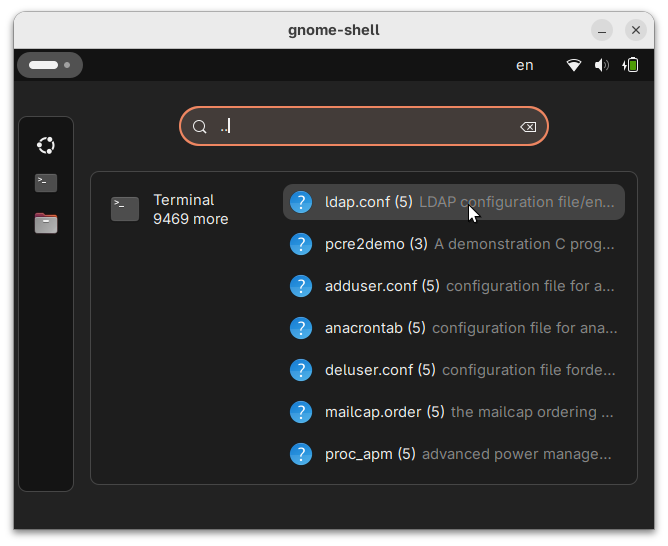

# Man Search Provider - Example for GNOME Shell Search Providers

> **Found an issue?**  
> If you find any inaccuracies or have suggestions for improvements, please [open an issue](https://github.com/LumenGNU/ManSearchProvider/issues).

- **This is an example/template implementation** for developers who want to create their own GNOME Shell search providers. Not intended for end-user installation.
- **Tech Stack:** TypeScript, GNOME Shell Extensions API

This fully functional extension demonstrates how to implement a GNOME Shell search provider. While it works and can be installed, it's designed primarily as an example implementation for developers creating their own search providers.

> **See:**  
> [Search Provider Implementation](SearchProviderImplementation.md) for code description and explanation of the extension structure.

## How It Works

A search provider for quick access to man pages directly from the GNOME Shell overview.

1. Open the overview (Super/Windows key)
2. Start typing a command, e.g., `grep`, `vim`, `git`, `git clone` etc.
3. See search results from all installed man pages
4. Click on a result to open the man page in the terminal

## Usage

Simply start typing in the overview. The provider activates automatically for any query of 2 or more characters.

## Implementation Features

- Uses `apropos --and` for searching
- Displays command name, section, and description
- Opens man page in terminal on click
- Minimum query length: 2 characters

## Installation

This code is designed as **an example** implementation of a search provider through a GNOME Shell extension and is **not intended** for end-user consumption.

> **For developers:**  
> See the Development section below for setup instructions.

# Development

This project is written in **TypeScript** and should only be used as an example or "template" for implementing your own **search provider**.

See the information below for how to install and start development.

> **See:**  
> [Search Provider Implementation](SearchProviderImplementation.md) for code description and explanation of the extension structure.

> **Note:**  
> This guide covers basic development workflow only. It does not include complete instructions for packaging and publishing your extension. For comprehensive documentation on these topics, refer to the relevant sections at [GJS Guide](https://gjs.guide/extensions/)

## Requirements

- GNOME Shell version 45-48 (for version 49+ see note below)
- Node.js 18+ and npm
- TypeScript 5+ (but installed automatically via npm)
- Type definitions for GNOME Shell Extensions (but installed automatically via npm)

required only for this example:

- `man-db` in the system
- `org.gnome.Terminal` aka `gnome-terminal` in the system

### Target GNOME Shell Versions

This is an example extension for **GNOME Shell 45-48**.

> **Note for GNOME Shell 49+:**  
> The extension itself may work in GNOME Shell 49+, but the development workflow described below won't work because X11 is disabled by default. [To debug extensions in GNOME 49+, use the development kit](https://gjs.guide/extensions/upgrading/gnome-shell-49.html#debugging):
> ~~~sh
> dbus-run-session -- gnome-shell --devkit
> ~~~

## Development Documentation

See:
- [Gjs Guide](https://gjs.guide/extensions/)
- [Gjs Docs](https://gjs-docs.gnome.org/gjs/)
- [TypeScript type definitions for GNOME Shell Extensions](https://github.com/gjsify/gnome-shell/tree/main/packages/gnome-shell)

## Development Setup

1. Clone and install dependencies:

   ~~~sh
   git clone https://github.com/LumenGNU/ManSearchProvider.git
   cd ManSearchProvider
   npm install
   ~~~

2. Build and install the extension:
   
   ~~~sh
   npm run build    # TypeScript → JavaScript in ./dist
   npm run setup    # Copies to ~/.local/share/gnome-shell/extensions/
   ~~~

3. Start nested GNOME Shell for testing and debugging:
   
   ~~~sh
   npm run debug  # Opens terminal with debug output and nested Shell
   ~~~

4. Enable the extension inside nested Shell (**IMPORTANT**):

   Each time you start nested Shell with `npm run debug`, you need to enable the extension inside it (**each time**):

   - **Inside the running nested Shell**, open the Extensions application and enable "Man Search Provider"

   or

   - **Inside the running nested Shell**, open terminal and execute:
    
     ~~~sh
     gnome-extensions enable "man-search-provider@example.github.com"
     ~~~

5. Debugging

- Interact with the extension (start a search)
- Watch the debug output

## Development Workflow

### Main Commands

~~~sh
npm run build   # Compile TypeScript to ./dist
npm run setup   # Install extension to system
npm run debug   # Start nested GNOME Shell (opens terminal with debug output)
npm run dev     # Alias for `npm run build && npm run setup && npm run debug`
npm run clear   # Clear ./dist and remove installed extension
~~~

> **Note:**  
> `npm run debug` is an alias for `npm run nested-shell:restart`. See `package.json` for a complete list of commands.

> **Tip:**  
> Double-tap Tab for command completion to quickly browse available commands (e.g., `npm run <Tab><Tab>`)

### Typical Workflow

~~~sh
# 1. Changed code
# 2. Build, install and run in nested Shell:
npm run build && npm run setup && npm run debug

# 3. Shell crashed or closed the window? Restart:
npm run debug

# 4. Rebuild and reinstall:
npm run build && npm run setup

# 5. Restart nested Shell:
npm run debug

# 6. Clear system:
npm run clear
~~~

### Common Mistakes

- Forget to recompile after code changes
- Forget to reinstall after build
- Forget to restart shell after installation
- Forget to enable the extension after starting nested Shell (**each time**)
- Forget to clear the system after debugging unstable code, risking it running on your main desktop after logout/login and potentially breaking your system

**Solution:** Use `npm run dev` for typical development cycle — it runs all three steps in the correct order. Remember that you still need to manually enable the extension inside the nested Shell.

## Nested Shell

- Opens nested Shell in a separate window
- Opens terminal window with log and debug output
- Safe for testing (doesn't crash your main desktop)
- Interaction with nested Shell may be significantly slower

Control nested Shell:

- Run: `npm run nested-shell:start`
- Stop and run (restart): `npm run nested-shell:restart`
- Stop: `npm run nested-shell:stop` or close the terminal window

⚠️ [**This is designed for GNOME Shell 45-48 and won't work in GNOME Shell 49+.**](https://gjs.guide/extensions/upgrading/gnome-shell-49.html#debugging)

> **Alternative:**  
> Instead of using nested Shell, you can log out and log back in to test the extension in your actual GNOME session. This is more stable but less convenient for rapid development and doesn't provide real-time debug output.

## Build and Debug Configuration

Settings in `package.json` section `config`:

~~~jsonc
"config": {
  "ID": "man-search-provider@example.github.com",            // Extension UUID
  "DIST_DIR": "./dist",                                      // Build directory
  "EXTENSION_DIR": "~/.local/share/gnome-shell/extensions",  // Installation path
  "TERMINAL": "gnome-terminal",                              // Terminal for debug logs
  "TERMINAL_PARAM": "--",                                    // Terminal parameter for running commands
  "LANG": "C",                                               // Useful for testing translations, e.g., de_DE.UTF-8, fr_FR.UTF-8
  "WIN_SIZE": "1280x720"                                     // Window size for view nested Shell
}
~~~

### For Your Extension, Change

- `ID` to your `UUID` (must match `uuid` in `metadata.json`)
- `TERMINAL` — your terminal program
- `TERMINAL_PARAM` — parameter for running commands (`--`, `-e`, or `-c` depending on your terminal)