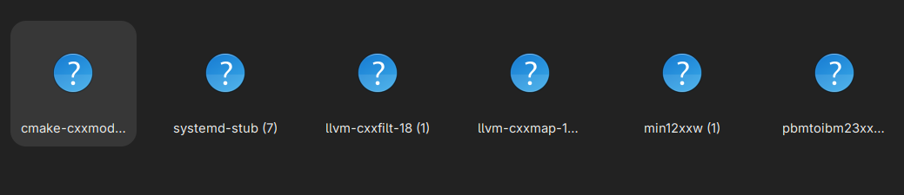
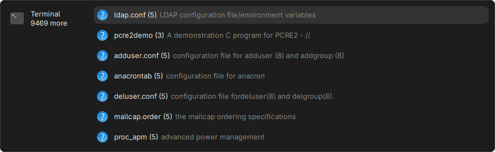
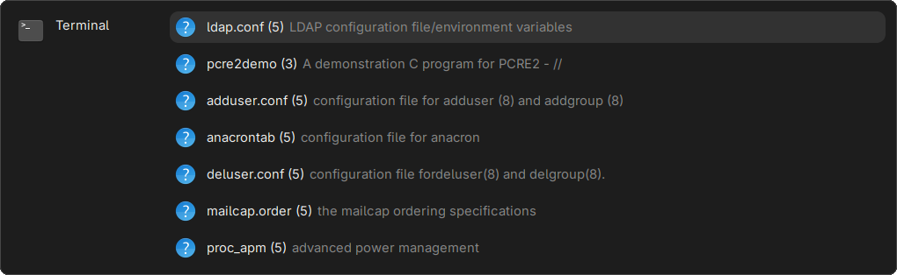

# Руководство по реализации Search Provider для GNOME Shell на TypeScript

# Введение

Поставщики поиска позволяют интегрировать собственные источники данных в общесистемный поиск GNOME, давая пользователям возможность находить нужную информацию, не покидая поисковый интерфейс Shell.

Этот документ описывает реализацию поставщика поиска (Search Provider) для GNOME Shell на **примере** расширения, написанного на TypeScript.

Документ объясняет, как реализовать интерфейсы `SearchProvider2` и `ResultMeta` на примере расширения предоставляющего поиска по документам `man` доступных в системе.

# Целевая аудитория

Документ предназначен для разработчиков расширений GNOME Shell, уже имеющих опыт работы с:

- TypeScript/JavaScript
- GJS (GNOME JavaScript bindings)
- Основами разработки расширений GNOME Shell

Документ фокусируется на специфике реализации Search Provider и не рассматривает общие вопросы разработки на TypeScript и GJS для GNOME Shell. Некоторую информацию по этим темам можно найти в разделе [Development в README.md](README.md). Также ознакомьтесь с дополнительными ресурсами.

# Дополнительные ресурсы

Для изучения API и базовых концепций рекомендуется ознакомиться с:

- [A Guide to JavaScript for GNOME](https://gjs.guide/) — комплексное руководство по GJS
- [Gio - 2.0 (C API)](https://docs.gtk.org/gio/index.html) — документация API GIO
- [hello-world](https://github.com/gjsify/gnome-shell/tree/main/examples/hello-world) — базовый пример реализации расширения GNOME Shell на TypeScript.

# Предварительные требования

Для работы с примером необходимо:

- GNOME Shell версии 45 или выше
- Понимание асинхронного программирования (Promises)
- Базовое знакомство с библиотекой GIO

# Структура документа

# Основные концепции

Поставщик поиска — это компонент, который:

- Получает поисковые запросы от GNOME Shell
- Выполняет поиск в своих данных
- Возвращает результаты для отображения в интерфейсе GNOME Shell
- Обрабатывает активацию результатов пользователем

В рамках расширения GNOME Shell поставщик поиска реализуется как отдельный класс, реализующий интерфейс `SearchProvider2`.

Для успешной реализации поставщика поиска необходимо, прежде всего, понять назначение двух ключевых интерфейсов:

- [`SearchProvider2`](#SearchProvider2) - интерфейс поставщика поиска
- [`ResultMeta`](#ResultMeta) - интерфейс объект метаданных результата

Далее рассмотрим интерфейс `SearchProvider2`, определяющий контракт между Shell и расширением.

# Интерфейс SearchProvider2

## Обзор

`SearchProvider2` — интерфейс для реализации поставщика поиска в расширении GNOME Shell.

Ваш класс должен реализовать этот интерфейс, чтобы Shell мог зарегистрировать и использовать его как поставщика поиска. Он определяет набор свойств и методов, необходимых для корректного взаимодействия с GNOME Shell при обработке поисковых запросов.

**Реализация в примере**: [SearchProvider.ts](src/SearchProvider.ts)

## Импорт

Импорт не требуется — доступен глобально.

## Свойства

### `id`

~~~typescript
readonly id: string;
~~~

**Описание**: Уникальный строковый идентификатор поставщика поиска в системе.

Должен быть уникальным среди всех поставщиков, не только среди расширений. Расширения обычно используют свой `UUID` в качестве этого идентификатора.

**Реализация в примере**: [SearchProvider.ts](src/SearchProvider.ts#L35)

### `appInfo`

~~~typescript
readonly appInfo: Gio.AppInfo | null
~~~

**Описание**: Метаинформация приложения для группировки и декорации результатов поиска.

Метаинформация из `appInfo` используется Shell для декорации и группировки результатов поиска.

Если свойство возвращает `null`, результаты поиска отображаются как отдельные значки без какой-либо группировки.

Расширение может зарегистрировать и вернуть собственный `GAppInfo` или использовать объект-заглушку.

Если свойство возвращает действительный `GAppInfo`, результаты группируются под значком и заголовком, полученными из метаданных приложения.

**Реализация в примере**: [SearchProvider.ts](src/SearchProvider.ts#L47)

### `canLaunchSearch`

~~~typescript
readonly canLaunchSearch: boolean
~~~

**Описание**: Управляет видимостью действия "Показать больше результатов".

Если свойство возвращает `true`, GNOME Shell отображает действие "Показать больше результатов", когда:
- результатов больше, чем можно отобразить одновременно, или
- метод `filterResults` отфильтровал часть результатов

При этом класс должен предоставить метод `launchSearch`, который будет вызван при активации этого действия.

Если свойство возвращает `false`, Shell не будет отображать это действие.

Это свойство не влияет на **доступность** действия, а только на его визуальное отображение. Фактическая доступность действия, и то как оно активируется, может зависеть от установленных расширений, темы, и т.п.

**Реализация в примере**: [SearchProvider.ts](src/SearchProvider.ts#L40)

## Методы

### `getInitialResultSet()`

~~~typescript
getInitialResultSet(
    terms: string[], 
    cancellable: Gio.Cancellable
): Promise<string[]>
~~~

**Описание**: Выполняет первоначальный поиск и возвращает *строковые идентификаторы* найденных результатов.

**Параметры**:

- `terms` — массив поисковых терминов (слова из запроса пользователя)
- `cancellable` — объект для отмены операции

**Возвращает**: Promise с массивом строковых идентификаторов результатов.

Вызывается при каждом новом поисковом запросе. Метод должен провести первоначальный поиск и вернуть *строковые идентификаторы* результатов. Примерами таких идентификаторов могут быть:

- URI файлов или ресурсов, соответствующих поисковому запросу
- Хеши
- ID записей в базе данных

Порядок идентификаторов определяет порядок отображения результатов.

Shell будет передавать эти идентификаторы в другие методы поставщика, когда необходимо обратиться к конкретному результату поиска для его отображения или активации.

**Важно**: Метод **должен** прервать поиск по сигналу от объекта [`cancellable`][GCancellable].

**Замечание**: Shell не устанавливает жёсткий таймаут, но ожидает, что метод остановит поиск, освободит связанные ресурсы и вернёт имеющиеся результаты при получении сигнала отмены.

**Замечание**: [Хотя документация требует][guide-search-provider] отклонять промис с ошибкой при прерывании, однако Shell, по-видимому, не обрабатывает такую ситуацию корректно  
https://gitlab.gnome.org/GNOME/gnome-shell/-/blob/main/js/ui/search.js?ref_type=heads#L702 (актуально для версий 46-48)  
Поэтому рекомендую всегда разрешать Promise — а в случае прерывания или ошибки возвращать пустой массив.

**Реализация в примере**: [SearchProvider.ts](src/SearchProvider.ts#L74)

### `getSubsearchResultSet()`

~~~typescript
getSubsearchResultSet(
    previousIdentifiers: string[], 
    terms: string[], 
    cancellable: Gio.Cancellable
): Promise<string[]>
~~~

**Описание**: Уточняет результаты поиска при добавлении новых поисковых терминов.

**Параметры**:

- `previousIdentifiers` — идентификаторы из предыдущего поиска
- `terms` — новые поисковые термины (включая предыдущие)
- `cancellable` — объект для отмены операции

**Возвращает**: Promise с массивом идентификаторов уточнённого или нового поиска.

Этот метод вызывается для уточнения текущих результатов при добавлении новых поисковых терминов. Метод может вернуть либо уточненное подмножество исходных результатов, либо выполнить новый поиск с обновлёнными терминами.

Метод можно использовать для оптимизации поиска, избегая полного пересоздания результатов, или просто делегировать вызов в `getInitialResultSet()`.

**Важно**: Метод **должен** прервать поиск по сигналу от объекта [`cancellable`][GCancellable]. Применяется то же правило разрешения Promise (возврат `[]`) при отмене, что и для `getInitialResultSet`.

**Реализация в примере**: [SearchProvider.ts](src/SearchProvider.ts#L202)

### `filterResults()`

~~~typescript
filterResults(identifiers: string[], maxResults: number): string[]
~~~

**Описание**: Ограничивает количество отображаемых результатов текущего поиска.

**Параметры**:

- `identifiers` — полный список идентификаторов текущих результатов
- `maxResults` — желаемое максимальное количество результатов для отображения

**Возвращает**: Усечённый массив идентификаторов результатов.

Метод может:

- просто возвращать первые n элементов
- использовать собственные критерии для отбора результатов
- игнорировать запрос и возвращать все результаты

**Важно**: Метод должен вернуть **подмножество исходного `identifiers`**. Добавление новых или изменение существующих идентификаторов недопустимо.

**Реализация в примере**: [SearchProvider.ts](src/SearchProvider.ts#L225)

### `getResultMetas()`

~~~typescript
getResultMetas(
    identifiers: string[], 
    cancellable: Gio.Cancellable
): Promise<ResultMeta[]>
~~~

**Описание**: Возвращает метаданные результатов для отображения в интерфейсе.

**Параметры**:

- `identifiers` — массив идентификаторов результатов
- `cancellable` — объект для отмены операции

**Возвращает**: Promise с массивом метаданных для каждого результата из `identifiers`.

Метод должен сопоставить каждому результату, перечисленному в массиве `identifiers`, соответствующий ResultMeta объект, включающий как минимум поля `id`, `name` и `createIcon`.

См. [Интерфейс ResultMeta](#ResultMeta)

**Замечание**: Shell не устанавливает жёсткий таймаут, но ожидает, что метод остановит обработку, освободит связанные ресурсы и вернёт *пустой* массив при получении сигнала отмены от объекта `cancellable`.

**Замечание**: [Хотя документация требует][guide-search-provider] отклонять промис с ошибкой при прерывании, однако Shell, по-видимому, не обрабатывает такую ситуацию корректно  
https://gitlab.gnome.org/GNOME/gnome-shell/-/blob/main/js/ui/search.js?ref_type=heads#L230 (актуально для версий 46-48)  
Поэтому рекомендую всегда разрешать промис — в случае прерывания или ошибки возвращать пустой массив.

**Реализация в примере**: [SearchProvider.ts](src/SearchProvider.ts#L127)

### `createResultObject()`

~~~typescript
createResultObject(meta: ResultMeta): Clutter.Actor | null
~~~

**Описание**: Создаёт пользовательский виджет для отображения результата.

**Параметры**:

- `meta` — метаданные результата

**Возвращает**:

- `Clutter.Actor` — пользовательский виджет (как правило, `St.Icon`)

или

- `null` — использовать стандартное отображение Shell

**Реализация в примере**: [SearchProvider.ts](src/SearchProvider.ts#L109)

### `activateResult()`

~~~typescript
activateResult(identifier: string, terms: string[]): void
~~~

**Описание**: Обрабатывает активацию результата поиска пользователем.

**Параметры**:

- `identifier` — идентификатор активированного результата
- `terms` — поисковые термины, приведшие к этому результату

Метод может быть пустым, если результат не требует дополнительных действий (например, если ResultMeta объект предоставляет `clipboardText`, и других активностей не предполагается).

Если метод реализован, он должен выполнить соответствующее действие (открыть файл, ресурс или запустить приложение и т.д.), связанное с **указанным результатом поиска**.

**Реализация в примере**: [SearchProvider.ts](src/SearchProvider.ts#L248)

### `launchSearch()`

~~~typescript
launchSearch(terms: string[]): void
~~~

**Описание**: Открывает полный поиск с заданными терминами. Вызывается, как правило, при активации действия "Показать больше результатов".

**Параметры**:

- `terms` — текущие поисковые термины

Метод может быть пустым (ничего не делать) или запустить соответствующее приложение/поисковый ресурс, передав в него поисковые термины.

**Реализация в примере**: [SearchProvider.ts](src/SearchProvider.ts#L281)

# Интерфейс ResultMeta

## Обзор

Интерфейс, определяющий метаданные результата поиска, которые GNOME Shell использует для отображения результата пользователю.

**Использование в примере**: [SearchProvider.ts](src/SearchProvider.ts#L154)

## Свойства

### `id`

~~~typescript
id: string
~~~

Уникальный идентификатор результата.

### `name`

~~~typescript
name: string
~~~

Название результата (лейб/метка).

### `description`

~~~typescript
description?: string
~~~

Описание результата. Необязательное поле.

### `clipboardText`

~~~typescript
clipboardText?: string
~~~

Текст для помещения в буфер обмена. Необязательное поле.

Если `clipboardText` предоставлен, он автоматически помещается в буфер обмена при активации результата параллельно с вызовом `activateResult`.

Используется для:

- URL веб-страницы
- Путь к файлу
- Результат вычисления (для калькуляторов)
и т.п.

### `createIcon`

~~~typescript
createIcon: (size: number) => Clutter.Actor
~~~

Функция, возвращающая значок для результата с указанием размера.

**Параметры**:

- `size` — размер иконки в пикселях

**Возвращает**: `Clutter.Actor` с иконкой.

**Замечание**: При вычислении размера значка необходимо учитывать текущий коэффициент масштабирования в системе (`St.ThemeContext.get_for_stage(global.stage)`).

**Реализация в примере**: [SearchProvider.ts](src/SearchProvider.ts#L159)

# Архитектура примера расширения

## Обзор

Пример расширения реализован через три основных класса:

~~~
ExampleExtension
       :
       : управляет
       :
       v                           <<interface>>
 SearchProvider ┈┈ реализует ┈┈▷  SearchProvider2
       |
       | расширяет
       |
       ▽
  SearchEngine (бизнес-логика поиска)
~~~

Эта архитектура обеспечивает:

- Отделение поисковой логики от интеграции с Shell
- `SearchEngine` можно тестировать независимо вне Shell
- Поисковый движок можно использовать вне контекста Search Provider
- `SearchProvider` легко адаптировать для работы с другим поисковым движком

> **NOTE**: Ваша реализация не обязана следовать этой архитектуре. Выбирайте подход целесообразно вашей задаче и сложности. Например, в простых случаях, сам класс расширения может реализовать интерфейс `SearchProvider2`:
>
> ~~~typescript
> export default class SearchProviderExtension extends Extension implements SearchProvider2 {
> 
>     private declare searchProvider: SearchProvider;
> 
>     enable() {
>         // Регистрирует себя как поставщика поиска
>         Main.overview.searchController.addProvider(this);
>     }
> 
>     disable() {
>         // Отмена регистрации
>         Main.overview.searchController.removeProvider(this);
>     }
> 
>     // Добавляем еще одну ответственность:
>     // реализуем интерфейс SearchProvider2
>     id: string = this.uuid;
>     appInfo: Gio.AppInfo = ...;
>     //...
>     async getInitialResultSet(terms, cancellable) {
>         //...
>     }
>     async getResultMetas(identifiers, cancellable) {
>         //...
>     }
>     // и остальные поля интерфейса SearchProvider2
>     //...
> }
> ~~~

## Класс `SearchEngine`

[Файл: SearchEngine.ts](src/SearchEngine.ts)

**Назначение**: Инкапсулирует всю логику поиска по man-страницам. Поисковый движок.

**Ответственности**:

- Запуск системных команд apropos и whatis
- Парсинг вывода команд
- Предоставление данных для создания мета-объектов (заголовок и описание страницы)

**Ключевые методы**:

~~~typescript
class SearchEngine {

    // Основной поиск по всей базе man-страниц.
    // Формируем команду `apropos` с поиском по всем терминам переданным в `terms`
    // Парсит (`parseAproposOutput`) и возвращаем результат как массив
    // идентификаторов в формате `command|section`.
    // Поддерживает отмену поиска.
    protected async searchManPages(terms: string[], cancellable: Gio.Cancellable): Promise<string[]>
    
    // Получение метаданных (заголовок и описание) о конкретной странице.
    // Формируем команду `whatis` для конкретной страницы и парсит результат.
    // Возвращает кортеж [title, description] для указанного идентификатора, или
    // `null` при отмене или ошибке.
    // Поддерживает отмену процесса.
    protected async getPageInfo(identifier: string, cancellable: Gio.Cancellable): Promise<[title: string, description: string] | null>
    
    // Парсинг вывода apropos.
    // Используется в `searchManPages` для формирования массива идентификаторов
    // из результатов поиска apropos.
    private parseAproposOutput(output: string, cancellable: Gio.Cancellable): string[]
}
~~~

> **Формат идентификаторов**: В данном примере используется формат `command|section` 
(например, `printf|1`, `printf|3`), позволяющий однозначно идентифицировать 
man-страницу и её раздел.

**Замечание**: Класс не зависит от GNOME Shell API и работает напрямую с системой.

## Класс SearchProvider

[Файл: SearchProvider.ts](src/SearchProvider.ts)

**Назначение**: Адаптирует `SearchEngine` для работы с GNOME Shell в качестве поставщика поиска.

**Ответственности**:

- Реализация интерфейса `SearchProvider2`
- Делегация в `SearchEngine` поисковых запросов

**Наследование и ключевые моменты**:

~~~typescript
// Расширяет `SearchEngine` и реализует `SearchProvider2` интерфейс
class SearchProvider extends SearchEngine implements SearchProvider2 {

    // --- Свойства SearchProvider2 ---

    readonly id: string;

    // Поиск производится "от лица" `org.gnome.Terminal`
    readonly appInfo: Gio.AppInfo | null;

    // Возвращает `true`
    readonly canLaunchSearch: boolean;
    

    // --- Методы SearchProvider2 ---

    // Запускает поиск если первый поисковый термин имеет длину хотя бы 2 символа.
    // Делегирует поиск в `searchManPages`.
    async getInitialResultSet(terms: string[], cancellable: Gio.Cancellable): Promise<string[]>

    // Запускает новый поиск с новым `terms`.
    async getSubsearchResultSet(_previousResults: string[], terms: string[], cancellable: Gio.Cancellable): Promise<string[]>

    // Сокращает поиск до семи результатов.
    filterResults(identifiers: string[], _maxResults: number): string[]

    // Формирует метаданные результата.
    // Получает метаданные через `getPageInfo`.
    // Создает и заполняет объекты метаданных для результатов.
    async getResultMetas(identifiers: any[], cancellable: Gio.Cancellable): Promise<ResultMeta[]>

    // Данная реализация всегда возвращает `null`.
    createResultObject(_resultMeta: ResultMeta): Clutter.Actor | null

    // Для активированного результата открывает соответствующую
    // man-страницу в терминале.
    activateResult(result: string, _terms: string[]): void

    // При активации открывает терминал с apropos и передает в него поисковые термины.
    launchSearch(terms: string[]): void

}
~~~

**Примечание**: Наследование от `SearchEngine` позволяет напрямую вызывать методы поиска без дополнительной обёртки.

## Класс `ExampleExtension`

[Файл: extension.ts](src/extension.ts)

**Назначение**: Точка входа расширения, управление жизненным циклом.

Ответственности:

- Создание экземпляра `SearchProvider`
- Регистрация его как поставщика поиска в GNOME Shell
- Корректная очистка ресурсов при отключении расширения

~~~typescript
export default class ExampleExtension extends Extension {

    private declare searchProvider: SearchProvider;

    enable() {
        // Создание и регистрация поставщика
        this.searchProvider = new SearchProvider(this.uuid);
        Main.overview.searchController.addProvider(this.searchProvider);
    }

    disable() {
        // Отмена регистрации поставщика
        Main.overview.searchController.removeProvider(this.searchProvider);
        this.searchProvider = null as never;
    }

}
~~~

## Поток данных

~~~
Пользователь вводит запрос
    ↓
GNOME Shell → SearchProvider.getInitialResultSet(terms)
                 ↓
            SearchEngine.searchManPages(terms)
                 ↓
            выполняет `apropos` и парсит результаты
            возвращает идентификаторы
                            ↓
                          Shell
                            ↓
                    SearchProvider.getResultMetas(identifiers)
                    заполняет метаданные
                    возвращает метаданные
                            ↓
          Shell отображает результаты пользователю
~~~

## О такой архитектуре

Разделение ответственности:

- `SearchEngine` — чистая бизнес-логика, независимая от UI
- `SearchProvider` — адаптер между Shell и движком
- `ExampleExtension` — минимальная обёртка для lifecycle

Тестируемость:

- `SearchEngine` можно тестировать в изоляции

Расширяемость:

- Легко заменить "движок" на другой источник данных
- Можно добавить кэширование на уровне `SearchEngine`
- `SearchProvider` можно переиспользовать для других поисковых движков

[GCancellable]: https://docs.gtk.org/gio/class.Cancellable.html
[guide-search-provider]: https://gjs.guide/extensions/topics/search-provider.html
