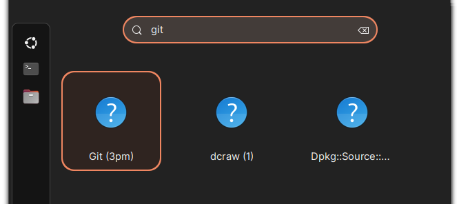
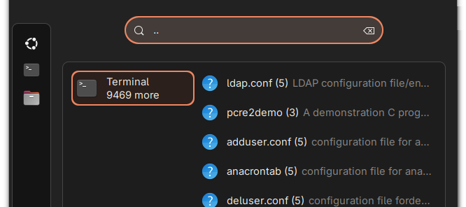
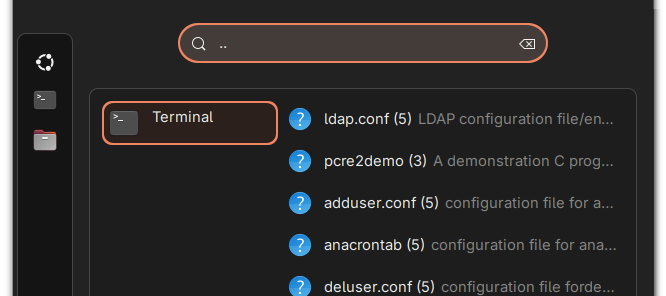
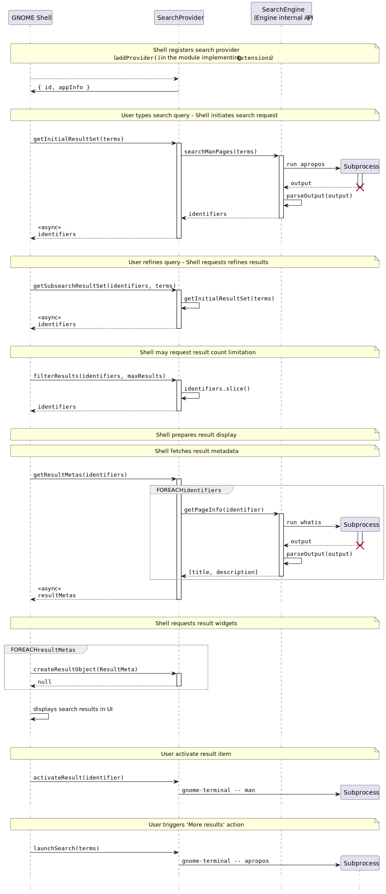

# Guide to Implementing a Search Provider for GNOME Shell in TypeScript

> **Found an issue?**  
> If you find any inaccuracies or have suggestions for improvements, please [open an issue](https://github.com/LumenGNU/ManSearchProvider/issues).

## Target Audience

This document is intended for GNOME Shell extension developers who already have experience with:

- TypeScript/JavaScript
- GJS (GNOME JavaScript bindings)
- Basics of GNOME Shell extension development

The document focuses on the specifics of implementing a Search Provider and does not cover general aspects of development with TypeScript and GJS for GNOME Shell. For additional information on these topics, see the [Development section in README.md](README.md#development). See also additional resources.

## Introduction

Search Providers allow you to integrate your own data sources into GNOME's system-wide search, giving users the ability to find relevant information directly from the shell's search interface.

This guide describes the implementation of a Search Provider for GNOME Shell using an extension written in **TypeScript** as an example.

The document explains how to implement the `SearchProvider2` and `ResultMeta` interfaces using an extension that searches installed man pages as a practical example

## Additional Resources

To learn about the API and basic concepts, see:

- [A Guide to JavaScript for GNOME — comprehensive guide to GJS](https://gjs.guide/)  
  Useful sections include:
  - [Asynchronous Programming. Promises](https://gjs.guide/guides/gjs/asynchronous-programming.html#promises)
  - [Gio Subprocesses](https://gjs.guide/guides/gio/subprocesses.html#subprocesses)
  - [Search Provider Implementation (JS)](https://gjs.guide/extensions/topics/search-provider.html#search-provider)
- [GJS Overrides — GJS quirks and peculiarities](https://gjs-docs.gnome.org/gjs-overrides/)
- [Gio2.0 — GIO C API documentation](https://docs.gtk.org/gio/index.html)
- [Writing a Search Provider — D-Bus/C SearchProvider2 Interface](https://developer.gnome.org/documentation/tutorials/search-provider.html#)
- [HIG Patterns — Search](https://developer.gnome.org/hig/patterns/nav/search.html#)
- [hello-world — basic GNOME Shell extension example using TypeScript](https://github.com/gjsify/gnome-shell/tree/main/examples/hello-world)

## Prerequisites

To work with the example, you need:

- GNOME Shell version 45 or higher
- Understanding of asynchronous programming (Promises)
- Basic familiarity with the GIO library

# Core Concepts

A Search Provider is a component that:

- Receives search queries from GNOME Shell
- Performs searches within its own data
- Returns results to be displayed in the GNOME Shell interface
- Handles the activation of results by the user

Within a GNOME Shell extension, a Search Provider is a class that implements the `SearchProvider2` interface.

To successfully implement a Search Provider, you must to understand the purpose of two key interfaces:

- [`SearchProvider2`](#searchprovider2-interface) - the search provider interface
- [`ResultMeta`](#resultmeta-interface) - the result metadata interface

Below are descriptions of the `SearchProvider2` and `ResultMeta` interfaces, that define the contract between the Shell and the extension.

# `SearchProvider2` Interface

## Overview

`SearchProvider2` is the interface for implementing a search provider in a GNOME Shell extension.

Implementing this interface allows the class to be used by GNOME Shell as a Search Provider. The interface defines a set of properties and methods needed to interact with GNOME Shell when processing search queries.

**Implementation Example:** [SearchProvider.ts](src/SearchProvider.ts)

- ### Import TODO

  ~~~typescript
  import {
      SearchProvider2
  } from './types/SearchProvider2Interface.js';
  ~~~
 
  **Implementation Example:** [SearchProvider.ts](src/SearchProvider.ts#L27)
  - - - - -

## Properties

- ### `id`

  ~~~typescript
  readonly id: string;
  ~~~
 
  **Description:**  
  A unique string identifier for the search provider.
 
  Must be unique among all search providers in the system. Extensions typically use their `UUID` as this identifier.
  
  **Implementation Example:** [SearchProvider.ts](src/SearchProvider.ts#L53)
  - - - - -

- ### `appInfo`
 
  ~~~typescript
  readonly appInfo: Gio.AppInfo | null
  ~~~
 
  **Description:**  
  Metadata for the search provider's application. The Shell uses this to display results from this provider in a separate block.
 
  When `appInfo` is provided, the Shell creates a separate block for all results from this provider, displaying them under a common header and icon.
 
  >   
  > When set to `null`, the provider's results appear in the general list without being grouped into a distinct block. The "Show more results" action may not be available, and the maximum number of displayed results is determined by the Shell.
 
  An extension can register and return its own `GAppInfo` or use a placeholder object.
 
  >   
  > When returning a valid `GAppInfo`, all provider results are grouped in a separate block, which uses the title and icon from the application's metadata.
 
  **Implementation Example:** [SearchProvider.ts](src/SearchProvider.ts#L60)
  - - - - -
 
 
- ### `canLaunchSearch`
 
  ~~~typescript
  readonly canLaunchSearch: boolean
  ~~~
 
  **Description:**  
  Controls the visibility of the "Show more results" action.
 
  >   
  > When set to `true`, GNOME Shell displays the "Show more results" action
  
  when:
  - `appInfo` returns a valid `GAppInfo`, and
  - there are more results than can be displayed at once, or
  - the `filterResults` method has filtered out some results
 
  This requires implementing the `launchSearch` method, which will be called when this action is activated.
 
  >   
  > When set to `false`, the Shell does not display this action.
 
  > **Note:**  
  > The property only controls the display of the action, not its actual availability. The ability to activate the action may depend on installed extensions, the theme, and other factors.
 
  **Implementation Example:** [SearchProvider.ts](src/SearchProvider.ts#L79)
  - - - - -
 

## Methods

- ### `getInitialResultSet()`

  ~~~typescript
  getInitialResultSet(
      terms: string[],
      cancellable: Gio.Cancellable
  ): Promise<string[]>
  ~~~
 
  **Description:**  
  Performs the initial search and returns *string identifiers* of the found results.
 
  **Parameters:**
  - `terms` — array of words from the search query (search terms)
  - `cancellable` — object for canceling the operation
 
  **Returns:**  
  A Promise with an array of string identifiers for the results.

  Called for each new search query. The method should perform a search and return an array of unique identifiers. Each identifier must uniquely correspond to its result.
  
  Examples of identifiers:
  - URIs of files or resources
  - Hashes or UUIDs of results
  - Database record IDs, etc.
 
  The order of identifiers determines the display order of results.

  The Shell passes these identifiers to other provider methods when accessing specific results for their display or activation.

  > **Important:**  
  > The method **must** terminate the search upon receiving a cancellation signal from the [`cancellable`][GCancellable] object.
 
  > **Note:**  
  > The Shell does not set a hard timeout, but expects the method to stop searching, release related resources, and return available results when receiving a cancellation signal.

  > Although the [documentation requires][guide-search-provider] rejecting the promise with an error when interrupted, the Shell apparently does not handle this correctly.  
  > (Applies to versions 46-48).  
  > It is recommended to always resolve the Promise, and in case of interruption or error, return an empty array.
 
  **Implementation Example:** [SearchProvider.ts](src/SearchProvider.ts#L98)
  - - - - -

- ### `getSubsearchResultSet()`

  ~~~typescript
  getSubsearchResultSet(
      previousIdentifiers: string[],
      terms: string[],
      cancellable: Gio.Cancellable
  ): Promise<string[]>
  ~~~
 
  **Description:**  
  Refines search results when new search terms are added.
 
  **Parameters:**
  - `previousIdentifiers` — identifiers from the previous search
  - `terms` — updated array of terms (including previous ones)
  - `cancellable` — object for canceling the operation
 
  **Returns:**  
  A Promise with an array of identifiers for the refined results.

  Called when new terms are added to an existing query. The method can either refine current results or perform a new search.

  For optimization, you can filter existing results instead of performing a full re-search. Alternatively, you can simply delegate the call to `getInitialResultSet()`.
 
  > **Important:**  
  > The method **must** terminate the search upon receiving a cancellation signal from the [`cancellable`][GCancellable] object.

  > **Note:**  
  > The same cancellation handling rules apply as for `getInitialResultSet()`: it is recommended to always resolve the Promise, returning an empty array in case of interruption or error.

  **Implementation Example:** [SearchProvider.ts](src/SearchProvider.ts#L142)
  - - - - -

- ### `filterResults()`

  ~~~typescript
  filterResults(identifiers: string[], maxResults: number): string[]
  ~~~
 
  **Description:**  
  Limits the number of displayed results.
 
  **Parameters:**
 
  - `identifiers` — complete list of identifiers for current results
  - `maxResults` — maximum number of results to display
 
  **Returns:**  
  A Truncated array of identifiers.
 
  The method can:
  - simply return the first N elements
  - use custom criteria for selecting results
  - ignore the request and return all results

  

  > **Important:**  
  > The method must return a **subset of the original `identifiers` array**. Adding new identifiers or modifying existing ones is not allowed.
 
  **Implementation Example:** [SearchProvider.ts](src/SearchProvider.ts#L162)
  - - - - -

- ### `getResultMetas()`

  ~~~typescript
  getResultMetas(
      identifiers: string[],
      cancellable: Gio.Cancellable
  ): Promise<ResultMeta[]>
  ~~~
 
  **Description:**  
  Returns metadata for displaying results in the interface.
 
  **Parameters:**
  - `identifiers` — array of result identifiers
  - `cancellable` — object for canceling the operation
 
  **Returns:**  
  A Promise with an array of metadata for each result.
 
  The method must return a `ResultMeta` object for each identifier in the `identifiers` array. Each object must contain at least the `id`, `name`, and `createIcon` fields.
 
  See [The `ResultMeta` Interface](#resultmeta-interface)
 
  > **Note:**  
  > The Shell does not set a hard timeout, but expects the method to stop processing, release resources, and return an **empty** array when receiving a cancellation signal from the `cancellable` object.
 
  > **Note:**  
  > Although the [documentation requires][guide-search-provider] rejecting the promise with an error when interrupted, the Shell apparently does not handle this correctly.  
  > (Applies to versions 46-48)  
  > It is recommended to always resolve the promise, returning an empty array in case of interruption or error.
 
  **Implementation Example:** [SearchProvider.ts](src/SearchProvider.ts#L188)
  - - - - -

- ### `createResultObject()`

  ~~~typescript
  createResultObject(meta: ResultMeta): Clutter.Actor | null
  ~~~
 
  **Description:**  
  Creates a custom widget for displaying a result.
 
  **Parameters:**
  - `meta` — result metadata
 
  **May return:**  
  - `Clutter.Actor` — custom widget (typically an `St.Icon`)  
    or
  - `null` — to use the Shell's standard rendering
 
  **Implementation Example:** [SearchProvider.ts](src/SearchProvider.ts#L253)
  - - - - -

- ### `activateResult()`

  ~~~typescript
  activateResult(identifier: string, terms: string[]): void
  ~~~
 
  **Description:**  
  Handles the activation of a search result by the user.
 
  **Parameters:**  
  - `identifier` — identifier of the activated result
  - `terms` — search terms that led to this result
 
  The method can be empty if the result requires no additional actions (for example, if the ResultMeta object provides `clipboardText`, and no other activities are expected).
 
  If implemented, the method should perform the appropriate action (open a file, resource, or launch an application, etc.) associated with the **specified search result**.
 
  **Implementation Example:** [SearchProvider.ts](src/SearchProvider.ts#L272)
  - - - - -

- ### `launchSearch()`

  ~~~typescript
  launchSearch(terms: string[]): void
  ~~~
 
  **Description:**  
  Opens a full search with the specified terms. Called when the "Show more results" action is activated.
 
  **Parameters:**  
  - `terms` — current search terms
 
  The method can be empty (do nothing) or launch the corresponding application/search resource, passing it the search terms.
 
  **Implementation Example:** [SearchProvider.ts](src/SearchProvider.ts#L306)
  - - - - -

  
&nbsp;

# `ResultMeta` Interface

## Overview

An interface that defines search result metadata, which GNOME Shell uses to display the result to the user.

**Usage in the example:** [SearchProvider.ts](src/SearchProvider.ts#L214)

- ### Import TODO

  ~~~typescript
  import {
      ResultMeta
  } from './types/SearchProvider2Interface.js';
  ~~~
  - - - - -

## Properties

- ### `id`
  
  ~~~typescript
  id: string
  ~~~
  
  **Description:**  
  A unique identifier for the result. Must be unique among all current search results and uniquely identify the result.
  - - - - -

- ### `name`

  ~~~typescript
  name: string
  ~~~
 
  **Description:**  
  The display name for the result.
  - - - - -

- ### `description`
 
  ~~~typescript
  description?: string
  ~~~
 
  **Description:**  
  An additional description of the result. This field is optional.
  - - - - -

- ### `clipboardText`
 
  ~~~typescript
  clipboardText?: string
  ~~~

  **Description:**  
  Text to be placed in the clipboard. This field is optional.
 
  When `clipboardText` is present, the text is automatically placed in the clipboard when the result is activated, in parallel with the `activateResult` call.
 
  Used for:
 
  - Website URLs
  - File paths
  - Calculation results (e.g., from a calculator)
  - - - - -

- ### `createIcon`
 
  ~~~typescript
  createIcon: (size: number) => Clutter.Actor
  ~~~
 
  A callback function that returns an icon of the specified size for this result.
 
  **Parameters:**
 
  - `size` — icon size in pixels
 
  **Returns:**  
  A `Clutter.Actor` with the icon.
 
  > **Note:**  
  > The actual icon size should take into account the current scaling factor in the system (`St.ThemeContext.get_for_stage(global.stage)`).

  **Usage in the example:** [SearchProvider.ts](src/SearchProvider.ts#L223)
  - - - - -

&nbsp;

# Example Extension Architecture

## Overview

The example extension is implemented through three main classes:

- `SearchEngine` - Core search business logic, system interaction
- `SearchProvider` - GNOME Shell interaction
- `ExampleExtension` - Main extension class

This architecture provides:

- Separation of search logic from GNOME Shell integration
- Inheritance from `SearchEngine` allows `SearchProvider` to directly call search methods without an additional wrapper
- `SearchEngine` can be tested independently, outside the GNOME Shell environment
- The search engine can be used outside the Search Provider context
- `SearchProvider` can be easily adapted to work with a different search engine

## Interaction Diagram

Below is the sequence of interactions between GNOME Shell and **this** search provider implementation.

**Notation:**  
`terms` — search terms entered by the user  
`identifiers` — an array of unique identifiers for search results  
`identifier` — an identifier for a specific result  
`resultMetas` — an array of ResultMeta objects  
`resultMeta` — a ResultMeta object for a specific result  

**Key points:**  
- Asynchronicity: All search methods are asynchronous and return Promises
- Cancellation: All search methods support interruption of long operations-running (not reflected in the diagram)
- Repeated calls: The Shell may call methods multiple times when the query changes (not reflected in the diagram)
- If the user refines the query: this implementation simply calls `getInitialResultSet` again
- The Shell can create a special widget for each result (`createResultObject`), but this implementation always returns `null` — the Shell will use its standard display template
- Result activation: The provider launches `gnome-terminal` with the `man` command to open the required page
- "More results" activation: The provider launches `gnome-terminal` with the `apropos` command to show the complete list of matching commands

## Description of Components

### `SearchEngine` Class

[File SearchEngine.ts](src/SearchEngine.ts)

**Purpose:**  
Contains the search business logic, works with system utilities to get information about man pages. It acts as the search engine.

**Responsibilities:**  
- Running system commands `apropos` and `whatis` to perform searches
- Parsing command output
- Providing page data (title and description)

**Code Navigator:**
- [SearchEngine.ts](src/SearchEngine.ts)
  - [class `SearchEngine`](src/SearchEngine.ts#L77) — Search engine for system manual pages
    - [method `searchManPages`](src/SearchEngine.ts#L103) — Searches for manual pages matching the given terms
    - [method `getPageInfo`](src/SearchEngine.ts#L172) — Retrieves a detailed description of a manual page
    - [method `runSubprocess`](src/SearchEngine.ts#L231) — Runs a command and returns parsed output
    - [method `parseOutput`](src/SearchEngine.ts#L313) — Parses output from 'whatis' or 'apropos' commands
  - [Debugging and Prototyping Block](src/SearchEngine.ts#L422) — Sandbox for debugging, prototyping, and manually  verifying the core logic

**Key points:**

~~~typescript

// Promisify Gio async methods to use with async/await
Gio._promisify(Gio.Subprocess.prototype, 'communicate_utf8_async');
Gio._promisify(Gio.Subprocess.prototype, 'wait_async');

class SearchEngine {

    protected async searchManPages(
        terms: string[],
        cancellable: Gio.Cancellable
    ): Promise<string[]> {
        // Main search across the entire man-pages database.
        // Forms an `apropos` command with a search for all terms passed in `terms`.
        // Parses and returns the result as an array of identifiers
        // Supports cancellation.
    }

    protected async getPageInfo(
        identifier: string,
        cancellable: Gio.Cancellable
    ): Promise<[title: string, description: string] | null> {
        // Retrieves metadata (title and description) about a specific page.
        // Forms a `whatis` command for a specific page and parses the result.
        // Returns a tuple [title, description] for the specified identifier.
        // Supports cancellation.
    }

    private parseOutput(
        output: string,
        cancellable: Gio.Cancellable
    ): string[] {
        // Parses output from 'whatis' or 'apropos' commands into structured data.
        // Supports cancellation.
    }
}
~~~

> **Developer Note:**
>
> **Identifier Format:**  
> In this implementation, the format `section|command` is used as string identifiers to uniquely identify a man page. For example: `1|printf`, `3|printf`.
>
> **Debugging and Prototyping:**  
> The class is independent of GNOME Shell API and works directly with the system. Therefore, it can be debugged and tested independently, outside the GNOME Shell environment. For a demonstration of this, see the "Debugging and Prototyping Block".
>
> **Locale and nested Shell:**  
> If you're using the development process described in [Development Workflow](README.md#development-workflow), note that the nested Shell launches with the locale configuration specified in [Build and Debug Configuration](README.md#build-and-debug-configuration). This is important to consider since the search commands `apropos` and `whatis` are locale-dependent.
- - - - -

### `SearchProvider` Class

[File SearchProvider.ts](src/SearchProvider.ts)

**Purpose:**  
Adapts the `SearchEngine` to work with GNOME Shell. Implements the `SearchProvider2` interface, serving as a bridge between GNOME Shell and the search business logic.

**Responsibilities:**  
- Handling requests from the Shell
- Converting data between the Shell and `SearchEngine` formats
- Launching applications when a result is activated
- Launching applications when the "Show more results" action is triggered

**Code Navigator:**
- [SearchProvider.ts](src/SearchProvider.ts)
  - [imports](src/SearchProvider.ts#L27)
  - [class `SearchProvider`](src/SearchProvider.ts#L37)
    - [constructor](src/SearchProvider.ts#L44)
    - [property `id`](src/SearchProvider.ts#L53) — Unique identifier of the provider
    - [property `AppInfo`](src/SearchProvider.ts#L60) — AppInfo of the provider
    - [property `canLaunchSearch`](src/SearchProvider.ts#L79) — Controls the visibility of the "Show more results" label
    - [method `getInitialResultSet`](src/SearchProvider.ts#L98) — Initiates a new search
    - [method `getSubsearchResultSet`](src/SearchProvider.ts#L142) — Refines the current search
    - [method `filterResults`](src/SearchProvider.ts#L162) — Filters the current search results
    - [method `getResultMetas`](src/SearchProvider.ts#L188) — Get metadata for results
    - [method `createResultObject`](src/SearchProvider.ts#L253) — Create a result object
    - [method `activateResult`](src/SearchProvider.ts#L272) — Called when a search result is activated
    - [method `launchSearch`](src/SearchProvider.ts#L306) — Launch the search provider application

**Inheritance and key implementation details:**  

~~~typescript
import { SearchProvider2, ResultMeta } from '@girs/gnome-shell/extensions/global';

// Extends `SearchEngine` and implements `SearchProvider2` interface
class SearchProvider extends SearchEngine implements SearchProvider2 {

    // --- Properties ---

    readonly id: UUID;

    // Search is performed "on behalf of" `org.gnome.Terminal`
    readonly appInfo: lookup_app("org.gnome.Terminal.desktop").appInfo;

    // Returns `true`
    readonly canLaunchSearch: true;

    // --- Methods ---

    async getInitialResultSet(terms: string[], cancellable: Gio.Cancellable): Promise<string[]> {
        // Initiates search if the first search term has a length of at least 2 characters.
        // Delegates the search to the `SearchEngine::searchManPages`.
        return await this.searchManPages(terms, cancellable);
    }

    async getSubsearchResultSet(_previousResults: string[], terms: string[], cancellable: Gio.Cancellable): Promise<string[]> {
        // Simply starts a new search with the new `terms`.
        return this.getInitialResultSet(terms, cancellable);
    }

    filterResults(identifiers: string[], _maxResults: number): string[] {
        // Limits the search to seven results.
        return identifiers.slice(0, 7);
    }

    async getResultMetas(identifiers: string[], cancellable: Gio.Cancellable): Promise<ResultMeta[]> {
        // Forms result metadata.
        // Retrieves metadata through `SearchEngine::getPageInfo`.
        // Creates and populates metadata objects for results.
        const resultMetas = [] as ResultMeta[];
        for (const identifier of identifiers) {
            const pageInfo = await this.getPageInfo(identifier, cancellable);
            // ...
            const meta: ResultMeta = {...};
            resultMetas.push(meta);
        }
        return resultMetas;
    }

    createResultObject(_resultMeta: ResultMeta): Clutter.Actor | null {
        // This implementation always returns `null`.
        return null;
    }

    activateResult(result: string, _terms: string[]): void {
        // For an activated result, opens the corresponding
        // man page in the terminal.
        Gio.Subprocess.new(
            ['gnome-terminal', '--', 'man', `${section}`, `${name}`],
            Gio.SubprocessFlags.NONE
        );
    }

    launchSearch(terms: string[]): void {
        // When activated, opens a terminal with apropos and passes the search terms to it.
        Gio.Subprocess.new(
            ['gnome-terminal', '--', 'bash', '-c', `"apropos ${terms.join(' ')}"`], 
            Gio.SubprocessFlags.NONE
        );
    }

}
~~~
- - - - -

### `ExampleExtension` Class

[File extension.ts](src/extension.ts)

**Purpose:**  
The main extension class that manages the search provider lifecycle.

**Responsibilities:**

- Creating and initializing the `SearchProvider`
- Registering it as a search provider in GNOME Shell
- Cleaning up resources when the extension is disabled

~~~typescript
export default class ExampleExtension extends Extension {

    private declare searchProvider: SearchProvider;

    enable() {
        // Create and register the provider
        this.searchProvider = new SearchProvider(this.uuid);
        Main.overview.searchController.addProvider(this.searchProvider);
    }

    disable() {
        // Unregister the provider
        Main.overview.searchController.removeProvider(this.searchProvider);
        this.searchProvider = null as never;
    }

}
~~~

&nbsp;

## About this Architecture

Separation of Concerns:

- `SearchEngine` — pure business logic, independent of UI
- `SearchProvider` — adapter between the Shell and the engine
- `ExampleExtension` — minimal wrapper for lifecycle management

Testability:

- `SearchEngine` can be tested in isolation

Extensibility:

- Easy to replace the "engine" with another data source
- Caching can be added at the `SearchEngine` level
- `SearchProvider` can be reused for other search engines

> **Note:**  
> Your implementation doesn't have to follow this architecture. Choose an approach that makes sense for your task and complexity. For simple cases, the extension class can directly implement `SearchProvider2`:
>
> ~~~typescript
> // Extension class that directly implements the `SearchProvider2` interface
> export default class SearchProviderExtension extends Extension implements SearchProvider2 {
>
>     readonly id: string = this.uuid;
>     readonly appInfo: Gio.AppInfo;
>
>     enable() {
>         // Registers itself as a search provider
>         Main.overview.searchController.addProvider(this);
>     }
>
>     disable() {
>         // Unregisters itself
>         Main.overview.searchController.removeProvider(this);
>     }
>
>     //...
>     async getInitialResultSet(terms, cancellable) {
>         //...
>     }
>     async getResultMetas(identifiers, cancellable) {
>         //...
>     }
>     // and other fields and methods of the SearchProvider2 interface
>     //...
> }
> ~~~

# Implementing Your Own Provider and Best Practices

- Implement your "search engine". Key points:
  - It should perform searches based on search terms and
  - Provide unique identifiers for each found result
  - It should provide metadata for results (title, description, and possibly an icon) for the result specified by its identifier
- Adapt the `SearchProvider` to work with your engine

&nbsp;

- Always check `cancellable` in long-running operations
- Return an empty array when errors occur, don't throw exceptions
- Release resources
- Only log errors in the system journal, not operational details
- Test!

[GCancellable]: https://docs.gtk.org/gio/class.Cancellable.html
[guide-search-provider]: https://gjs.guide/extensions/topics/search-provider.html
